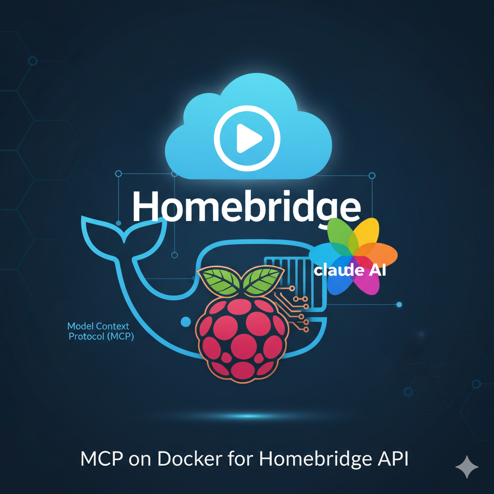

# Homebridge MCP Server

[](https://python.org)
[](https://docker.com)
[](https://homebridge.io)
[](https://claude.ai)
[](https://modelcontextprotocol.io)
[](LICENSE)
<meta property="article:published_time" content="2023-09-24T00:00:00Z">

A Model Context Protocol (MCP) server that provides seamless integration between Claude and Homebridge, enabling AI-powered control of HomeKit accessories.

## What is MCP?

The Model Context Protocol (MCP) is an open standard that enables AI assistants to securely connect to external data sources and tools. This server implements MCP to bridge Claude with your Homebridge setup, allowing natural language control of your smart home devices.

## Features

- **List and discover** all HomeKit accessories managed by Homebridge
- **Control individual devices** (power on/off, brightness, hue, saturation)
- **Quick toggle** functionality for instant device state changes
- **Detailed device inspection** with characteristics and capabilities
- **Room layout management** and organization
- **Bulk control** of multiple devices using name patterns
- **Cached accessory reset** to refresh device information

## Prerequisites

- Homebridge with Config UI X installed and running
- Homebridge must be running in **insecure mode** (`-I` flag) to enable accessory control
- Docker (for containerized deployment) or Python 3.7+
- Network access to your Homebridge instance

## Installation

### Option 1: Docker (Recommended)

```bash
# Clone the repository
git clone https://github.com/yourusername/homebridge-mcp-server.git
cd homebridge-mcp-server

# Build the Docker image
docker build -t homebridge-mcp-server .

# Run the container
docker run -it --rm \
  -e HOMEBRIDGE_HOST=homebridge.local:8081 \
  homebridge-mcp-server
```

### Option 2: Python Installation

```bash
# Clone the repository
git clone https://github.com/yourusername/homebridge-mcp-server.git
cd homebridge-mcp-server

# Install dependencies
pip install -r requirements.txt

# Run the server
python homebridge_server.py
```

## Configuration

Set the `HOMEBRIDGE_HOST` environment variable to point to your Homebridge Config UI X instance:

```bash
export HOMEBRIDGE_HOST=homebridge.local:8081
# or for custom IP/port
export HOMEBRIDGE_HOST=192.168.1.100:8581
```

## Enabling Homebridge Insecure Mode

To control accessories, Homebridge must run in insecure mode. Add the `-I` flag to your Homebridge startup command:

```bash
# If using systemd
sudo systemctl edit homebridge
# Add: ExecStart=/usr/local/bin/homebridge -I

# If using PM2
pm2 delete homebridge
pm2 start homebridge -- -I

# If using Docker
docker run -it --rm homebridge/homebridge -I
```

**Security Note**: Insecure mode allows API access to control your accessories. Ensure your Homebridge instance is not exposed to the internet.

## Available Tools

### Core Functions

- `list_accessories()` - Display all available HomeKit accessories
- `get_accessories_layout()` - Show room-based organization
- `get_accessory_details(unique_id)` - Get detailed device information

### Device Control

- `quick_toggle(unique_id)` - Toggle device power state
- `control_accessory(unique_id, action, value)` - Precise device control
  - Actions: `power`, `brightness`, `hue`, `saturation`
  - Values: `on`/`off`, `0-100` (brightness/saturation), `0-360` (hue)

### Management Functions

- `reset_cached_accessories()` - Clear and refresh device cache
- `create_room_groups()` - Organize devices by rooms automatically
- `control_room_devices(pattern, action, value)` - Control multiple devices by name pattern

## Usage Examples

### With Claude Desktop

Configure Claude Desktop to use this MCP server by adding to your configuration:

```json
{
  "mcp": {
    "servers": {
      "homebridge": {
        "command": "docker",
        "args": ["run", "-i", "--rm", "-e", "HOMEBRIDGE_HOST=homebridge.local:8081", "homebridge-mcp-server"]
      }
    }
  }
}
```

Then you can interact with Claude:

```
"Show me all my smart home devices"
"Turn on the living room lights"
"Set bedroom lamp brightness to 50%"
"Turn off all Christmas decorations"
```

### Command Line Usage

```bash
# List all accessories
echo '{"method": "tools/call", "params": {"name": "list_accessories"}}' | python homebridge_server.py

# Control a specific device
echo '{"method": "tools/call", "params": {"name": "control_accessory", "arguments": {"unique_id": "abc123", "action": "power", "value": "on"}}}' | python homebridge_server.py
```

## API Reference

### Authentication

The server uses Homebridge's `/api/auth/noauth` endpoint for authentication. Tokens are automatically managed and cached.

### Error Handling

Common error scenarios and solutions:

- **HTTP 400 "characteristicType should not be null"**: Check device compatibility and Homebridge insecure mode
- **HTTP 404**: Verify device unique_id exists using `list_accessories()`
- **Connection refused**: Confirm Homebridge Config UI X is running and accessible

## Troubleshooting

### Devices Not Responding
1. Verify Homebridge is in insecure mode (`-I` flag)
2. Check network connectivity to Homebridge instance
3. Reset cached accessories: `reset_cached_accessories()`

### Outdated Device Information
- Use `reset_cached_accessories()` to refresh device cache
- Restart Homebridge bridges after configuration changes

### Permission Issues
- Ensure the MCP server can reach your Homebridge instance
- Check firewall settings if running on different networks

## Development

### Project Structure

```
├── Dockerfile              # Container configuration
├── homebridge_server.py    # Main MCP server implementation
├── requirements.txt        # Python dependencies
├── CLAUDE.md              # Claude-specific documentation
└── README.md              # This file
```

### Contributing

1. Fork the repository
2. Create a feature branch
3. Make your changes
4. Test with your Homebridge setup
5. Submit a pull request

### Testing

Test the server with various Homebridge setups:

```bash
# Test connection
python homebridge_server.py --test-connection

# Validate device discovery
python homebridge_server.py --validate-devices
```

## Security Considerations

- **Network Security**: Only run insecure mode on trusted networks
- **Access Control**: Consider firewall rules to limit MCP server access
- **Authentication**: The server uses Homebridge's authentication system

## License

MIT License - see LICENSE file for details

## Related Projects

- [Homebridge](https://homebridge.io/) - HomeKit support for non-HomeKit devices
- [Homebridge Config UI X](https://github.com/homebridge/homebridge-config-ui-x) - Web-based management interface
- [Model Context Protocol](https://modelcontextprotocol.io/) - Open standard for AI tool integration

## Support

For issues and questions:
- Check the [Issues](https://github.com/yourusername/homebridge-mcp-server/issues) section
- Homebridge community: [Discord](https://discord.gg/kqNCe2D) | [Reddit](https://reddit.com/r/homebridge)
- MCP Documentation: [Specification](https://spec.modelcontextprotocol.io/)